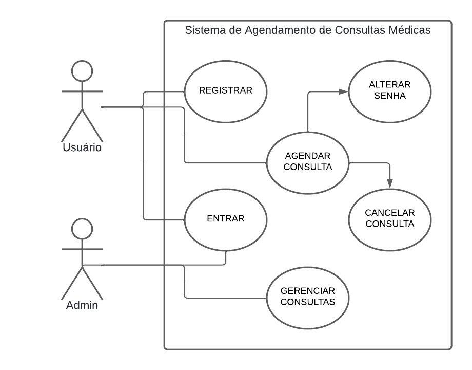
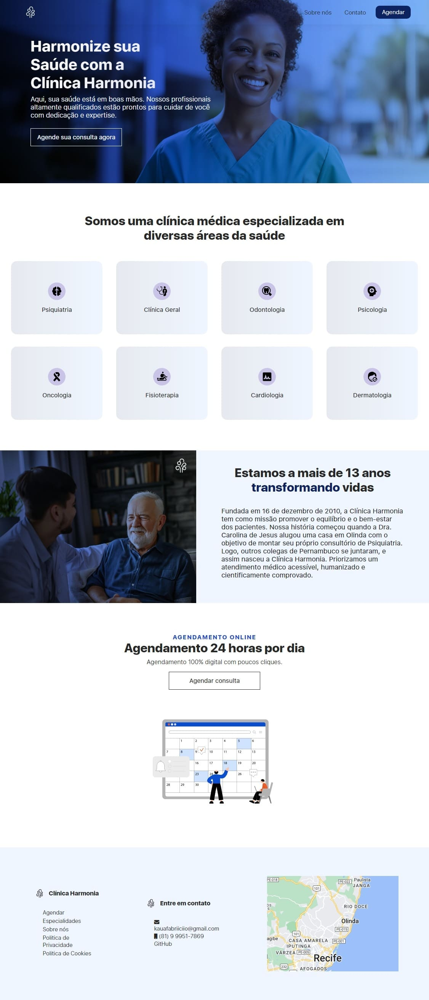

## Live Application
https://clinica-harmonia.vercel.app/

## Vídeo sobre o projeto
https://www.youtube.com/watch?v=8vI0CqfYXw4

## Sobre o projeto

Esse projeto pessoal tem a finalidade de resolver um problema de uma clínica médica fictícia chamada 'Clínica Harmonia' com um Sistema de Agendamento de Consultas Médicas Online para seus pacientes. O usuário pode registrar uma conta, entrar na conta, e através de um painel intuitivo, agendar a sua consulta de maneira simples e rápida, cancelar o agendamento quando quiser, e alterar a senha. Os profissionais da clínica podem ter acesso ao sistema através da conta do administrador para gerenciar as consultas, visualizando-as e removendo-as.

## Funcionalidades

**Login & Cadastro de usuário**: O sistema permite que o usuário crie uma conta com seu nome, cpf e senha, e faça o login para acessar o sistema.  
**Token JWT**: Após a autenticação confirmada do usuário, o sistema gera um token para usuário e armazena como cookie no navegador, expirando em uma hora. Dessa forma, o usuário não precisará logar no sistema novamente dentro de uma hora. O administrador do sistema também receberá um token ao fazer login no sistema para gerenciar as consultas, porém expirará em 10 horas.  
**Agendar consulta**: O usuário após fazer o login, pode agendar a consulta médica informando a especialidade, o profissional, a data da consulta e o horário. O limite de consultas agendadas por data/horário de um profissional é 3, e o usuário só poderá agendar uma consulta de um mesmo profissional.  
**Cancelar consulta**: O usuário poderá cancelar a consulta quando desejar com poucos cliques.  
**Alterar senha**: O sistema utiliza criptografia nas senhas dos usuários e permite que os mesmos alterem quando desejar.  
**Admin & Gerenciamento de Consultas**: O sistema permite o gerenciamento de consultas pelo administrador, com um painel para filtrar todas as consultas por especialidade e profissional, e para remover consultas.  

## Tecnologias utilizadas

**React**: Biblioteca React para desenvolver a interface do usuário, e a lógica do lado do cliente.  
**Nodejs**: Ambiente de execução Javascript no lado do servidor.  
**Expressjs**: Framework Nodejs para facilitar o desenvolvimento do servidor.  
**Mongoose**: Framework Nodejs para facilitar a integração do MongoDB.  
**MongoDB**: Banco de dados noSQL para armazenar dados do sistema.  

## Estrutura de pastas

**Client-side**

- **/clinica-harmonia-app**: Pasta raiz da aplicação front-end
    - **/public**: Arquivo HTML para ser renderizado em cada rota
    - **/src**: Código-fonte da aplicação
       - **/assets**: Arquivos de media, como imagens e fontes
       - **/components**: Componentes React da aplicação
       - **/pages**: Páginas da aplicação

**Server-side**

- **/server**: Pasta raiz da aplicação back-end
  - **/controllers**: Funções de controle das rotas
  - **/models**: Modelos dos dados do MongoDB
  - **/routes**: Rotas da API

## Imagens do projeto

  
Para visualizar mais imagens do projeto navegue o diretório "prints-do-projeto/".

# About the project

This personal project aims to solve a problem of a fictional medical clinic called 'Clínica Harmonia' with an Online Medical Consultations Scheduling System for its patients. The user can register an account, log account, and through an intuitive panel, schedule their consultations simply and quickly, cancel it whenever they want, and change the password. Clinic professionals can access the system through the administrator account to manage appointments, viewing and removing them.

## Functionalities

**Login & User registration**: The system allows the user to create an account with their name, social security number and password, and log in to access the system.  
**JWT Token**: After confirmed user authentication, the system generates a token for the user and stores it as a cookie in the browser, expiring in one hour. This way, the user will not need to log into the system again within an hour. The system administrator will also receive a token when logging into the system to manage schedulings, but it will expire in 10 hours.  
**Schedule consult**: After logging in, the user can schedule a medical consult by informing the speciality, the professional, the date of the consult and the time. The limit of consults scheduled per date/time for a professional is 3, and the user can only schedule an consult with the same professional.  
**Cancel consult**: The user can cancel the appointment whenever they wish with a few clicks.  
**Change password**: The system uses encryption in users passwords and allows them to change them whenever they wish.  
**Admin & Consultation Management**: The system allows the management of consultations by the administrator, with a panel to filter all consultations by speciality and professional, and to remove consultations.  

## Technologies used

**React**: React library for developing the user interface, and client-side logic.  
**Nodejs**: Javascript execution environment on the server side.  
**Expressjs**: Nodejs framework to facilitate server development.  
**Mongoose**: Nodejs framework to facilitate MongoDB integration.  
**MongoDB**: NoSQL database to store system data.  

## Folder structures

**Client-side**

- **/clinica-harmonia-app**: Root folder of the front-end application
    - **/public**: HTML file to be rendered on each route
    - **/src**: Application source code
       - **/assets**: Media files, such as images and fonts
        - **/components**: React components of the application
        - **/pages**: Application pages

**Server-side**

- **/server**: Root folder of the back-end application
   - **/controllers**: Route control functions
   - **/models**: MongoDB data models
   - **/routes**: API routes
   
