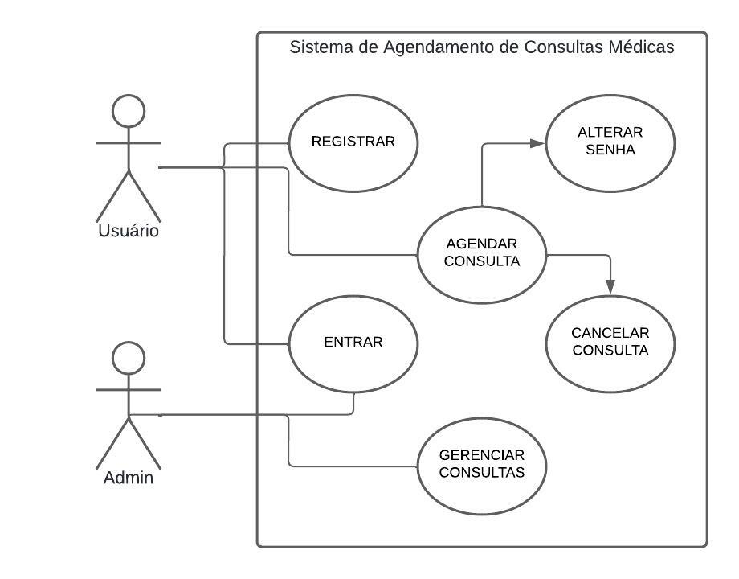
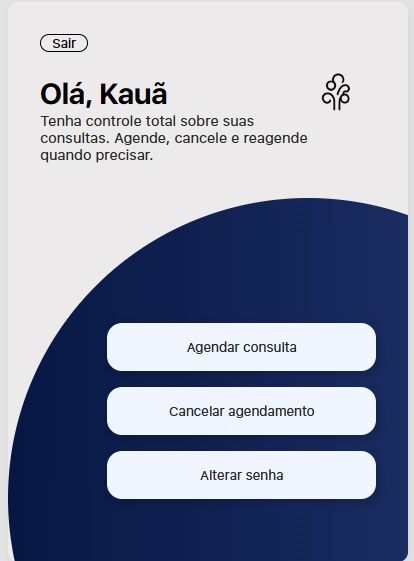

## Sobre o projeto

Esse projeto pessoal tem a finalidade de resolver um problema de uma clínica médica fictícia chamada 'Clínica Harmonia' com um Sistema de Agendamento de Consultas Médicas Online para seus pacientes. O usuário pode registrar uma conta, entrar na conta, e através de um painel intuitivo, agendar a sua consulta de maneira simples e rápida, cancelar o agendamento quando quiser, e alterar a senha. Os profissionais da clínica podem ter acesso ao sistema através da conta do administrador para gerenciar as consultas, visualizando-as e removendo-as.

## Funcionalidades

**Login & Cadastro de usuário**: O sistema permite que o usuário crie uma conta com seu nome, cpf e senha, e faça o login para acessar o sistema.
**Token JWT**: Após a autenticação confirmada do usuário, o sistema gera um token para usuário e armazena como cookie no navegador, expirando em uma hora. Dessa forma, o usuário não precisará logar no sistema novamente dentro de uma hora. O administrador do sistema também receberá um token ao fazer login no sistema para gerenciar as consultas, porém expirará em 10 horas.
**Agendar consulta**: O usuário após fazer o login, pode agendar a consulta médica informando a especialidade, o profissional, a data da consulta e o horário. O limite de consultas agendadas por data/horário de um profissional é 3, e o usuário só poderá agendar uma consulta de um mesmo profissional.
**Cancelar consulta**: O usuário poderá cancelar a consulta quando desejar com poucos cliques.
**Alterar senha**: O sistema utiliza criptografia nas senhas dos usuários e permite que os mesmos alterem quando desejar.
**Admin & Gerenciamento de Consultas**: O sistema permite o gerenciamento de consultas pelo administrador, com um painel para filtrar todas as consultas por especialidade e profissional, e para remover consultas.

## Tecnologias utilizadas

**React**: Biblioteca React para desenvolver a interface do usuário, e a lógica do lado do cliente.
**Nodejs**: Ambiente de execução Javascript no lado do servidor.
**Expressjs**: Framework Nodejs para facilitar o desenvolvimento do servidor.
**Mongoose**: Framework Nodejs para facilitar a integração do MongoDB.
**MongoDB**: Banco de dados noSQL para armazenar dados do sistema.

## Estrutura de pastas

**Client-side**:

/clinica-harmonia-app  # Pasta raiz da aplicação front-end
    /public            # Arquivo HTML para ser renderizado em cada rota
    /src               # Código-fonte da aplicação
        /assets        # Arquivos de media, como imagens e fontes
        /components    # Componentes React da aplicação
        /pages         # Páginas da aplicação

**Server-side**:

/server                # Pasta raiz da aplicação back-end
    /controllers       # Funções de controle das rotas
    /models            # Modelos dos dados do MongoDB
    /routes            # Rotas da API

## Imagens do projeto

